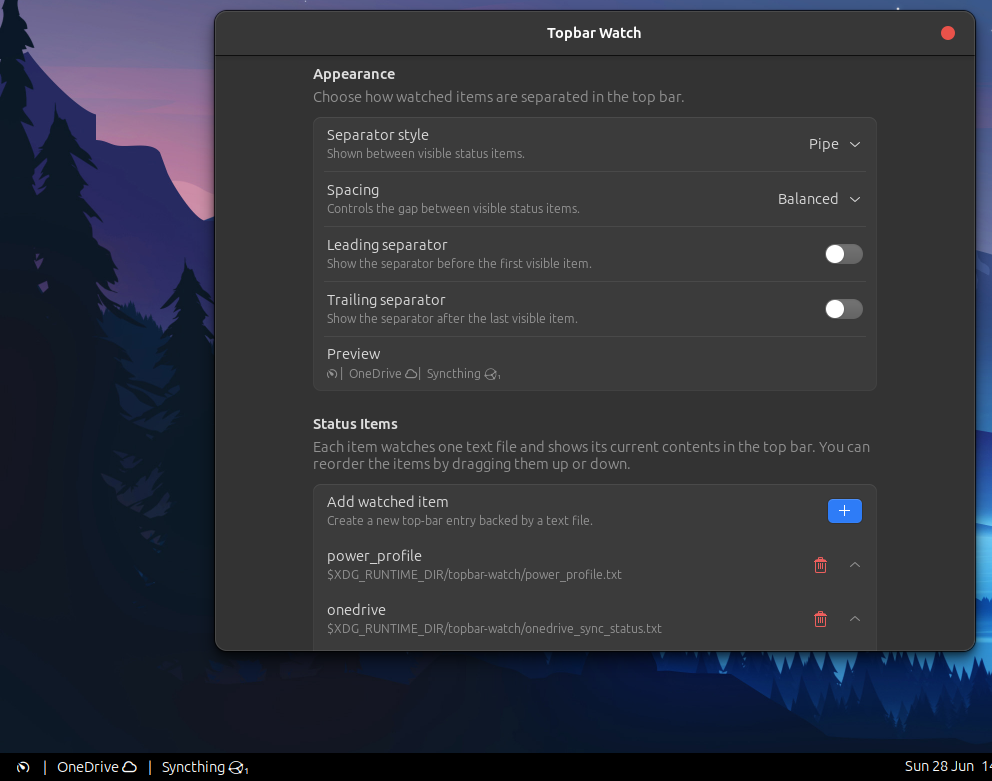
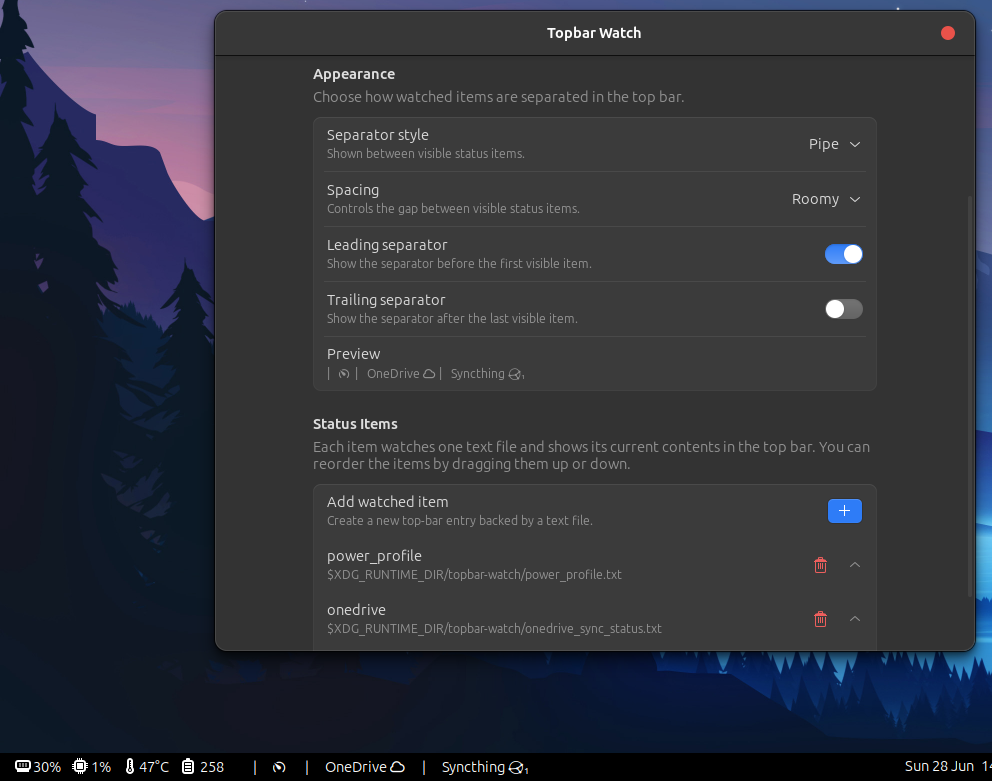

# Topbar Watch

Topbar Watch is a small GNOME Shell extension that shows text from watched files in the top bar.

It is useful for lightweight status output from scripts, sync tools, build jobs, timers, or any process that can write a short line of text to a file.

## Showcase

https://github.com/user-attachments/assets/34a73ce3-984d-4c52-b50e-2c63dcfe13d5






## Features

- Shows one or more status items in the GNOME top bar.
- Watches files and updates automatically when their contents change.

## What I use it for

I use Topbar Watch as a quiet status strip for things I want to notice without
opening another app:

- the current power profile;
- OneDrive daemon status, so it shows me when an error has occured
- Syncthing status, so I can see whether notes edited on my tablet are up to
  date and how many devices are currently connected.

## Configuration

Open the preferences window from GNOME Extensions, Extension Manager, or by clicking the extension in the top bar.

Each status item has:

- `ID`: a unique name for the item.
- `Watched file path`: the text file the extension should display.

Appearance is configured globally:

- `Separator style`: none, dot, pipe, slash, or bullet.
- `Spacing`: compact (4px), balanced (8px), or roomy (14px).
- `Leading separator`: show the separator before the first visible item.
- `Trailing separator`: show the separator after the last visible item.

User settings are saved to:

```text
~/.config/topbar-watch/status-items.json
```

The `status-items.json` file included in this repository is only the default example used when no user configuration exists yet.

## Example

Create a watched file:

```bash
mkdir -p "$XDG_RUNTIME_DIR/topbar-watch"
echo "Build passed" > "$XDG_RUNTIME_DIR/topbar-watch/build-status.txt"
```

Clear the item from the top bar:

```bash
printf "" > "$XDG_RUNTIME_DIR/topbar-watch/build-status.txt"
```

## Install locally

Copy or clone this repository to:

```text
~/.local/share/gnome-shell/extensions/topbar-watch@diegovoo.github.io
```

Then enable it:

```sh
gnome-extensions enable topbar-watch@diegovoo.github.io
```

If a newly added local extension doesn't show up, log out and back in, or
restart GNOME Shell on X11.

## License

MIT. See `LICENSE`.
